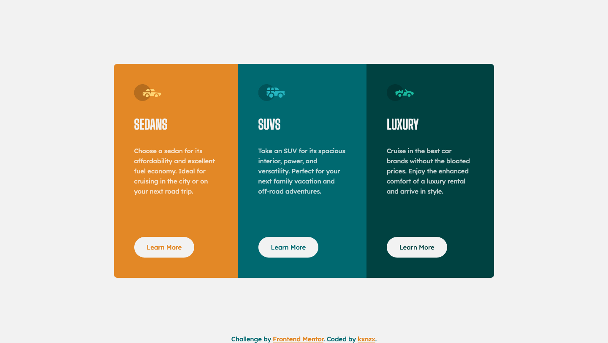

# Frontend Mentor - 3-column preview card component solution

This is a solution to the [3-column preview card component challenge on Frontend Mentor](https://www.frontendmentor.io/challenges/3column-preview-card-component-pH92eAR2-). Frontend Mentor challenges help you improve your coding skills by building realistic projects.

## Table of contents

- [The challenge](#the-challenge)
- [My process](#my-process)
  - [Built with](#built-with)
  - [What I learned](#what-i-learned)
  - [Continued development](#continued-development)
- [Author](#author)

### The challenge

Users should be able to:

- View the optimal layout depending on their device's screen size
- See hover states for interactive elements

### Screenshot



### Links

- [See Solution](https://www.frontendmentor.io/solutions/responsive-mobile-first-product-card-website-with-flexbox-rgbdkza9s)
- [Live Site](https://kxnzx.github.io/responsive-product-card/)

## My process

In chronological order:

- Google Fonts
- Custom Properties
- Reset
- Fonts
- Base Styles
- Mobile First
- Media Queries

### Built with

- Semantic HTML5 markup
- CSS custom properties
- Flexbox
- Mobile-first workflow
- CSS Media Queries

### What I learned

- I learned about the ch unit and decided to experiment with it in this challenge. This unit relates to the width of the "0" zero and calculates the width by the number of characters in a text. It is recommended to use between 60-75ch units to maintain readability of paragraphs.

- How to vertically center container in body:

```
html, body {
height: 100%;
}

html {
display: table;
margin: auto;
}

body {
display: table-cell;
vertical-align: middle;
}
```

- The above method didn't work out well in this case, because the footer did not stay at the bottom anymore. I have used this method instead:

```
html, body {
  height: 100%;
}

.container {
  display: flex;
  align-items: center;
  justify-content: center;
  height: 100%;
}
```

### Continued development

- CSS Flexbox
- CSS Grid
- CSS Pseudo-class selectors
- CSS Media Queries
- Javascript

## Author

- Frontend Mentor - [@kxnzx](https://www.frontendmentor.io/profile/kxnzx)
